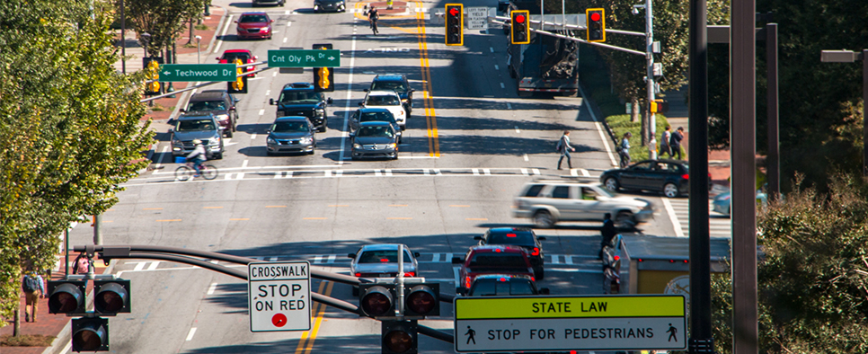

### [Home](README.md) | [Research Portfolio](/research.md) | [Research](research_projects.md) | [Other Interests](other_interests.md) | [Blog](blog.md) 

### Smart Cities Atlanta - North Avenue (under construction)

Image by (), accessed from  on 24 August 2020.

#### Research Brief

#### Smart Corridor Digital Twin 
To achieve benefits in traffic mobility, safety, and environemntal impacts, studies on smart corridor testbeds are being conducted in cities across the world. The overarching objective of this research is to explore benefits of high resolution data from smart corridors to imporive traffic and enviornmental impact performance measures. Towards this, a real-time smart corridor data-driven traffic simulation model, i.e. Digital Twin, is developed. that simulates traffic using (near) real-time volume and signal indication data streams from corridor and provides dynamic feedback on traffic and environmental performance measures of the corridor such as travel time, queue length, energy consumption, and CO2 emssion measures. Such as model can be used to evaluate performance of new ITS technologies on smart corridor such as adaptive signal timing, vehicle detction technologies etc. Smart corridor studied in this research is North Avenue Smart Corridor in Atlanta, Georgia. 

#### Data Loss Characteristics
Investigation of corridor data streams revealed presence of data loss in volume and signal indication data streams. For succesful implementation of the developed simulation model or any smart corridor application, it is imperative to understand the characteristics of the data loss in data streams, to develop data imputation methods, and  to evaluate impact of data imputation methods on simulation model generated performance measures. Exploratory analysis of corridor data streams are conducted to identify data loss characteristics. Simulations on developed Digita Twin are conducted to evaluate sensitivity of error in data imputation method on model generated travel time measures. First, sensitivty of model performance measure to a simple replacement temporal neighboring imputation method for volume data stream imputations is investigated. Next, performance of Long Short-Term Memory (LSTM) Recurrent Neural Network (RNN)layers for volume data imputations is explored. 

#### Deep Long Short-Term Memory RNN for Volume Imputation Model 
In this effort, univariate and multivariate volume imputation models that use Long Short-Term Memory Recurrent Neural Network layers are developed. Performance of the developed univariate and multivariate LSTM RNN models to impute data loss units is investigated on a typical traffic day and an atypical traffic day (holiday). Simulations on Digital Twin are conducted to evaluate the impact of the developed LSTM model imputations on Digital Twin generated performance measures. 

This research was also my dissertation research. For details please refer the relevant manuscripts listed below. 

#### Dissertation 
- Link to dissertation document (to be added)
  
#### Relevant Peer-Reviewed Conference Proceedings
- **Saroj, A.** A Sensitivity Analysis Study to Measure Impact of Real-Time Traffic Volume Data Imputations on Traffic Performance Measures. Winter Simulation Conference, National Harbor, Maryland, 2019. *(Ph.D. Colloquium - Extended Abstract, Podium Presentation, & Poster Presentation)* [[link to I-Sim WSC archive]](https://www.informs-sim.org/wsc19papers/290.pdf)
- **Saroj, A.**, S. Roy, R. Fujimoto, A. Guin, & M. Hunter. Smart City Real-Time Data-Driven Simulation. Winter Simulation Conference, Gothenburg, Sweden, 2018. *(Podium Presentation)* [[link to IEEE page]](https://ieeexplore.ieee.org/document/8632198?denied=)

#### Relevant Technical Report
- Hunter, M. P., R. L. Guensler, A. Guin, **A. Saroj**, and S. Roy. “Smart Cities Atlanta - North Avenue.” City of Atlanta, Atlanta, Georgia, December 2019. [[link to project report (pdf)]](http://realtime.ce.gatech.edu/RenewAtlanta-GeorgiaTech-Final-Report.pdf)

#### Relevant Journal Articles (in preparation)
- **Saroj, A.**, A. Guin, & M. Hunter. Deep LSTM Recurrent Neural Networks for Traffic Time Series Data Imputations. 2020. *(in preparation)*
- **Saroj, A.**, S. Roy, A. Guin, & M. Hunter. Sensitivity Analysis of Volume Data Imputations on a RealTime Data-Driven Traffic Simulation Model’s Performance Measures. 2020. *(in preparation)*

#### Relevant GitHub Repository - [CoA]()
- Contains python 3.7 code to develop simulation model using Vissim 9.00-08 COM interface

Last Updated: 24 August 2020

